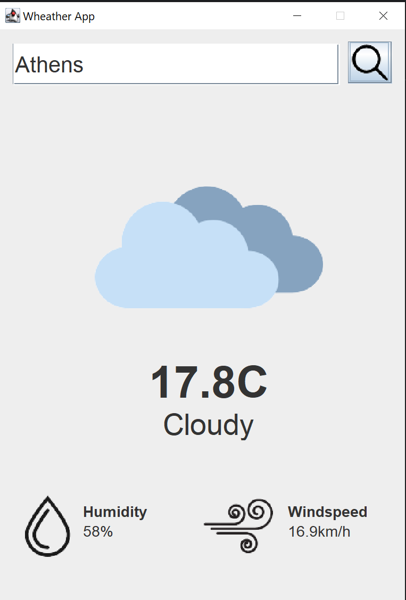

# Weather-App

This Weather Application is designed to provide information about the weather for any city worldwide. It is a Java-based application that utilizes the Swing framework for the graphic user interface (GUI). Users van input the name of a city and get instant access to weather information such as temperature, humidity and windspeed.

  

## Development
As mentioned before, the GUI is created using the Java Swing framework. The location data are being fetched from [Geocoding](https://open-meteo.com/en/docs/geocoding-api), a geolocation API from which we get the longitude and latitude for the given city, so we can then retrieve the weather data. For the weather data the [Weather Forecast API](https://open-meteo.com/en/docs) is being used. From that we get temprature, humidity, windspeed and the weather code, which is being used to display the correct image to describe the weather condition (eg. sunny, cloudy etc).
